Studentų Rūšiavimo Sistema v2.0

Release Istorija:
v0.1 (2025-09-25) - pradinė versija:

Galimybė įvesti nežinomą namų darbų kiekį (vartotojas pats nusprendžia, kada baigti įvestį).
Galimybė generuoti atsitiktinius pažymius tiek namų darbams, tiek egzaminui.
Sukurtas programos veiksmų pasirinkimo meniu.
Visas kodas realizuotas viename .cpp faile.
Programa paruošta tolesniam plėtojimui ir sinchronizuota su GitHub sistema.

v0.2 (2025-10-03):

Sukurta atsitiktinių studentų sąrašų generavimo galimybė.
Sugeneruoti penki duomenų failai, turintys po 1 000, 10 000, 100 000, 1 000 000 ir 10 000 000 įrašų.
Įdiegta studentų skirstymo funkcija:
Studentai, kurių galutinis balas < 5.0 – „vargšiukai“.
Studentai, kurių galutinis balas ≥ 5.0 – „kietakiai“.
Kiekviena grupė išvedama į atskirą failą.
Pridėtas programos veikimo spartos matavimas.
Atliktas kodo reorganizavimas.

v0.3 (2025-10-30):

Šioje versijoje atliktas konteinerių veikimo spartos tyrimas.

Konteinerių (Vector vs List) testavimo rezultatai

Testavimo Sistemos Parametrai:
- Modelis: MacBook Air
- Chip: Apple M2
- CPU Cores: 8 (4 performance + 4 efficiency)
- RAM: 8 GB Unified Memory
- Storage: 256 GB NVMe SSD
- OS: macOS Sonoma

Testavimo Rezultatai

Terminalo Rezultatai


Detali Rezultatų Lentelė


Grafine Analize

1,000 irasu


10,000 irasu


1,000,000 irasu


10,000,000 irasu


Išvados

Vector yra 5-10% greitesnis uz List didesniems duomenu kiekiams


Testavimo Metodologija
- Kiekvienas testas atliktas 3 kartus ir paimtas vidurkis
- Naudoti failai: 1K, 10K, 100K, 1M, 10M irasu
- Kiekvienas studentas turi 5 namu darbu pazymius + egzamina

v1.0 (2025-11-13):

- Visos 3 strategijos implementuotos (Vector ir List) 
- Išsamus konteinerių palyginimas (Vector vs List) 
- Atminties naudojimo matavimai ir analizė 
- Automatinis testavimas su įvairiais duomenų kiekiais 
- CMake build sistema 
- Pilna dokumentacija

Naudojimosi Instrukcija:

Tiesioginis kompiliavimas:

cd veronika_rim_v1
g++ -std=c++17 -O2 -o studentai *.cpp
./studentai

Programa palaiko 6 veikimo režimus: 
Pagrindiniai Režimai: 
f - Skaityti iš failo - apdoroti egzistuojantį failą 
g - Generuoti failą - sukurti naują testų failą 
p - Rankinis įvedimas - įvesti duomenis rankiniu būdu 
Testavimo Režimai: 
t - Testuoti konteinerius - Vector vs List palyginimas 
s - Strategijų palyginimas - visų 3 strategijų testavimas 
n - Naudoti strategiją - pasirinkti konkrečią strategiją

Testavimo rezultai(parametrai tokie patys kaip konteinerių testavimo):

Failas: palyginimo_test_1000.txt
Dydis, Strategija, Konteineris, Laikas(ms), Atmintis(baitai)
1000,strategija_1,vector,0,124048
1000,strategija_1,list,0,140048
1000,strategija_2,vector,0,124048
1000,strategija_2,list,0,140048
1000,strategija_3,vector,0,124048
1000,strategija_3,list,0,140048

Failas: palyginimo_test_10000.txt
Dydis, Strategija, Konteineris, Laikas(ms), Atmintis(baitai)
10000,strategija_1,vector,8,1240048
10000,strategija_1,list,7,1400048
10000,strategija_2,vector,7,1240048
10000,strategija_2,list,5,1400048
10000,strategija_3,vector,7,1240048
10000,strategija_3,list,5,1400048

Failas: palyginimo_test_100000.txt
Dydis, Strategija, Konteineris, Laikas(ms), Atmintis(baitai)
100000,strategija_1,vector,82,12400048
100000,strategija_1,list,80,14000048
100000,strategija_2,vector,72,12400048
100000,strategija_2,list,60,14000048
100000,strategija_3,vector,72,12400048
100000,strategija_3,list,58,14000048

Failas: palyginimo_test_1000000.txt
Dydis, Strategija, Konteineris, Laikas(ms), Atmintis(baitai)
1000000,strategija_1,vector,860,124000048
1000000,strategija_1,list,815,140000048
1000000,strategija_2,vector,725,124000048
1000000,strategija_2,list,596,140000048
1000000,strategija_3,vector,732,124000048
1000000,strategija_3,list,590,140000048

Failas: palyginimo_test_10000000.txt
Dydis, Strategija, Konteineris, Laikas(ms), Atmintis(baitai)
10000000,strategija_1,vector,9012,1240000048
10000000,strategija_1,list,8568,1400000048
10000000,strategija_2,vector,7527,1240000048
10000000,strategija_2,list,5889,1400000048
10000000,strategija_3,vector,7526,1240000048
10000000,strategija_3,list,6153,1400000048

Strategijų Aprašymas:
Strategija 1: Dvi naujos grupės
Sukuriami du nauji konteineriai
Studentai kopijuojami į atitinkamą grupę

Strategija 2: Viena nauja grupė + trynimas
Sukuriamas tik vargsiukų konteineris
Kietakiai lieka originaliame konteineryje


Strategija 3: STL algoritmai
Naudojami std::partition ir std::move
Efektyvus elementų perkėlimas


Išvados ir Rekomendacijos
-Greičiausias variantas: List su Strategija 3
-Vector užima mažiau atminties nei List
-Atminties skirtumas proporcingas duomenų kiekiui

Galutinės Rekomendacijos:
-Greičiui: Naudoti List su Strategija 3
-Atminčiai: Naudoti Vector su Strategija 2

Testavimo Metodologija
-Kiekvienas testas atliktas 3 kartus - rezultatai yra vidurkis
-Naudoti failai: 1K, 10K, 100K, 1M, 10M įrašų
-Kiekvienas studentas turi 5 ND pažymius + egzaminą

v1.1(2025-11-20):
Atnaujinta versija su class implementacija, optimizavimo testais ir išsamiu struct vs class
palyginimu.Optimizavimo flag'ų testavimas (O0, O1, O2, O3). 

Struct vs Class Spartos Palyginimas:

Testavimo Sąlygos:
Strategija 3
Konteineris: std::vector
Testavimo metodas: 3 kartų vidurkis


Rezultatai:

Dydis      Tipas    Skaitymas (ms)    Skirstymas (ms)    Bendras (ms)    Vargsiukai    Kietakiai
1,000      struct      5                  0                 6               424          576
1,000      class       4                  0                 5               424          576
10,000     struct     30                  7                 38             4,188        5,812
10,000     class      30                  7                 39             4,188        5,812
100,000    struct     302                 72                375            41,453       58,547
100,000    class      302                 72                398            41,453       58,547
1,000,000  struct     3,097               740               3,846         413,263      586,737
1,000,000  class      3,121               727               4,079         413,263      586,737

Greičio Skirtumai (Bendras Laikas):
Dydis    Struct (ms)    Class (ms)    Skirtumas    Procentais
1,000       6              5            -1 ms       -16.7%
10,000      38             39           +1 ms       +2.6%
100,000    375             398         +23 ms       +6.1%
1,000,000  3,846          4,079        +233 ms      +6.1%
Išvada: Class yra ~6% lėtesnė už Struct didesniems duomenų kiekiams

Optimizavimo Flag'ų Testavimas:
Optimizavimo testavimas:
chmod +x test_optimization.sh
./test_optimization.sh

Duomenų kiekis: 100,000 ir 1,000,000 studentų

Rezultatai (1,000,000 studentų):
Optimizavimas    Struct (ms)    Class (ms)    Skirtumas    EXE Dydis
O0                 3,611          3,865        +254 ms      246 KB
O1                  989           1,014         +25 ms      86 KB
O2                  989            991           +2 ms      86 KB
O3                 1,009           997          -12 ms      85 KB


Išvados:
Optimizavimas ženkliai pagerina našumą.
O2 lygis yra optimalus tarp greičio ir stabilumo.

v1.2 (2025-11-20):
Nauji Funkcionalumai:
// Copy konstruktorius
Studentas(const Studentas& other);

// Move konstruktorius  
Studentas(Studentas&& other) noexcept;

// Copy assignment operatorius
Studentas& operator=(const Studentas& other);

// Move assignment operatorius
Studentas& operator=(Studentas&& other) noexcept;

// Destruktorius
~Studentas();

Perdengti I/O Operatoriai:
Operatorių perdengimas (operator overloading) leidžia apibrėžti, kaip C++ operatoriai (>> ir <<)
veikia su sukurtomis klasėmis. 

// Įvesties operatorius
friend std::istream& operator>>(std::istream& is, Studentas& studentas);

// Išvesties operatorius
friend std::ostream& operator<<(std::ostream& os, const Studentas& studentas);

Demonstracinė Programa:

Naujas meniu punktas 'd' - demonstracinė programa, kuri leidžia pasirinkti:

Rule of Three/Five demonstracija - rodo visus 5 metodus veiksme

Rankinis įvedimas - vartotojas gali įvesti studento duomenis

Automatinis generavimas - sugeneruoja atsitiktinius pažymius

Įvestis iš failo - nuskaito studentus iš failo

Išvestis į failą - išsaugo studentus į failą

Visi režimai iš eilės - paleidžia visus režimus vienu metu


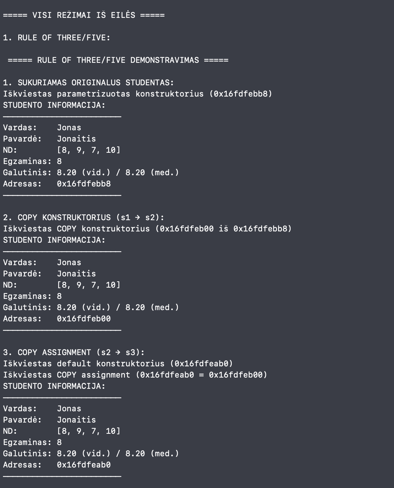
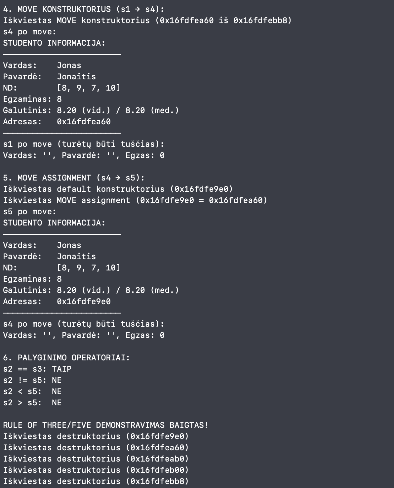
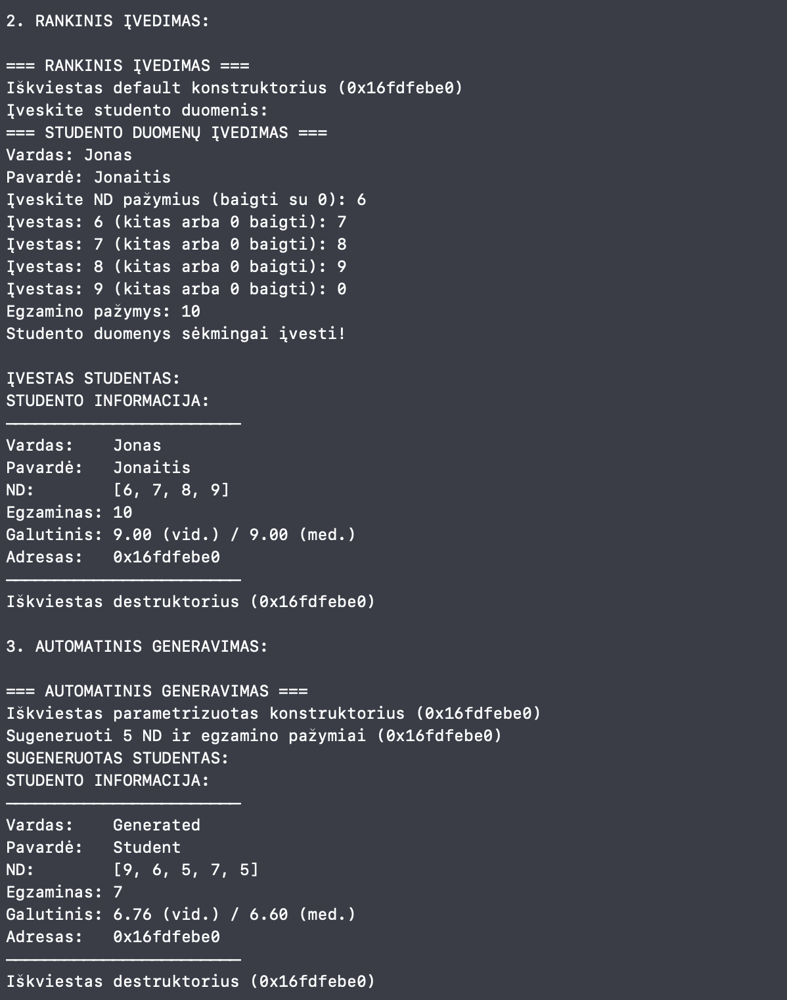
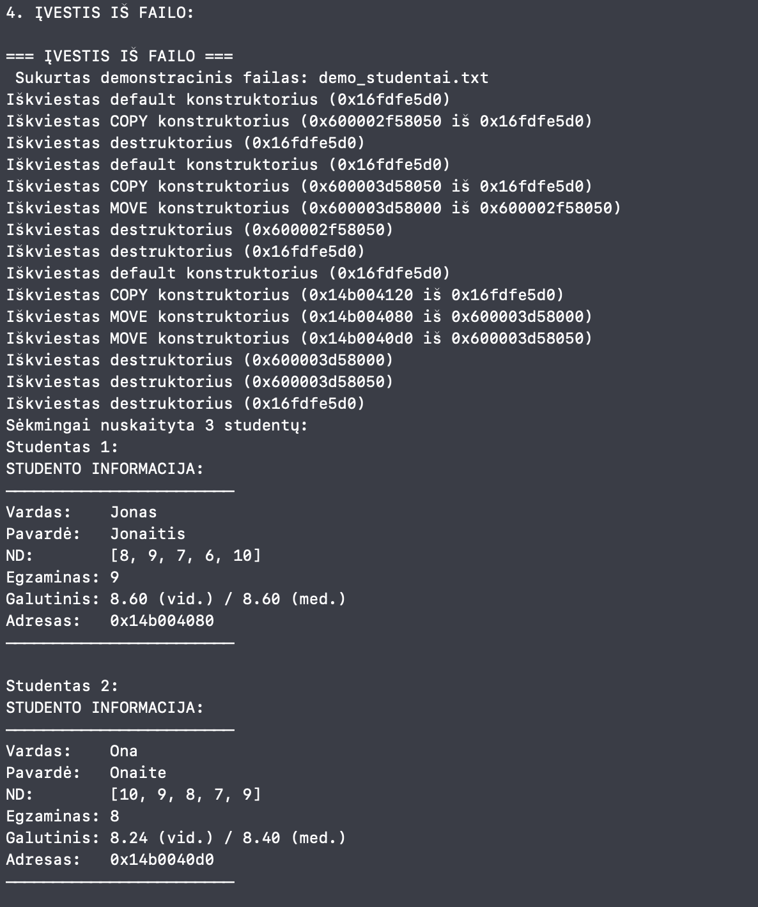
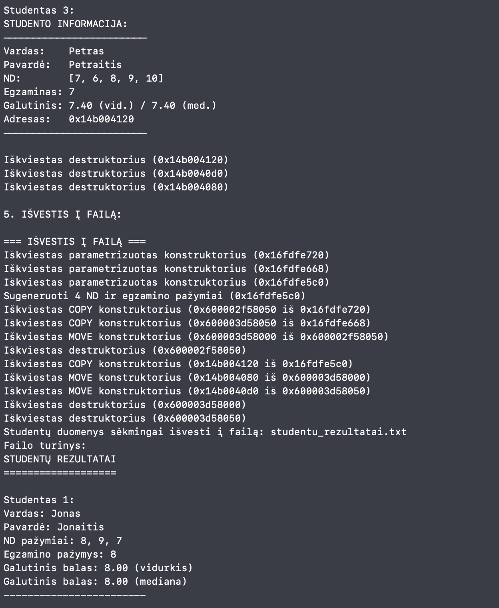
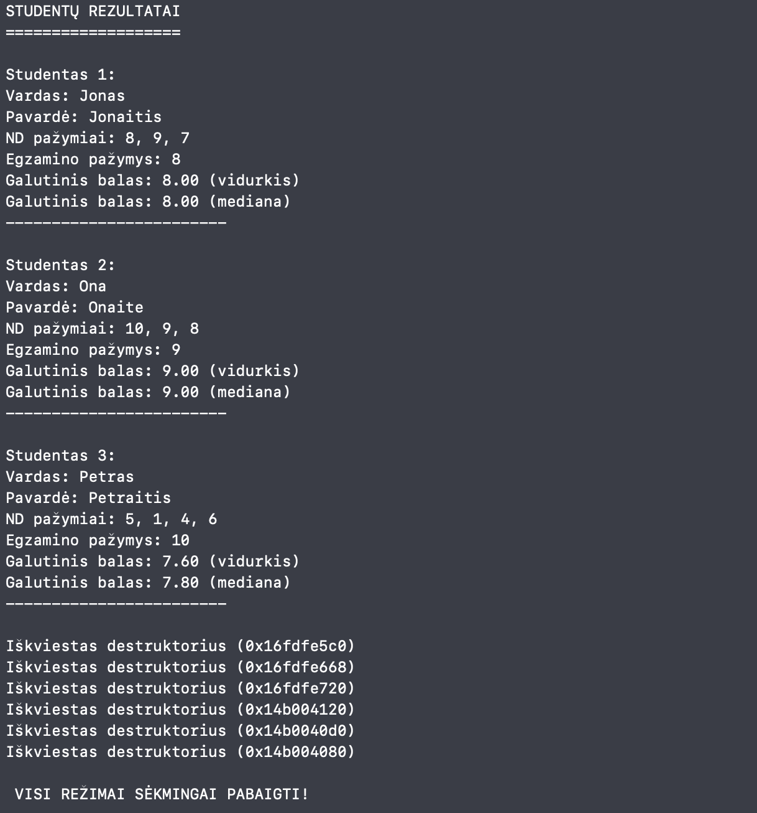

v1.5 (2025-11-26):

Naujas Objektų Hierarchijos Modelis:

Abstrakti Bazinė Klasė: Žmogus

class Zmogus {
protected:
    std::string vardas_;
    std::string pavarde_;

public:
    //klasė tampa abstrakčia, dėl abstrakčių metodų
    virtual void spausdintiInformacija() const = 0;
    
    virtual ~Zmogus() = default;
};

Išvestinė Klasė: Studentas
public:
    // Implementuojamas abstraktus metodas
    void spausdintiInformacija() const override;
    
    // Išlaikyta Rule of Five
    Studentas(const Studentas& other);
    Studentas(Studentas&& other) noexcept;
    
Abstrakčios klasės testavimas:

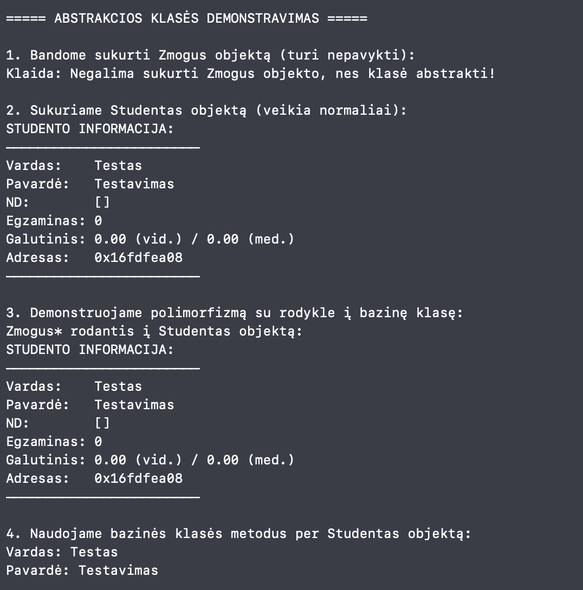

Kai eilutė neužkomentuota:
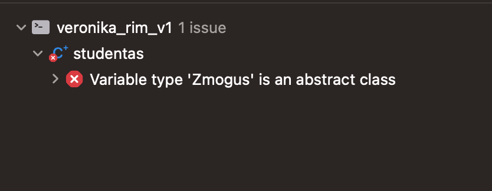

v0.2 (2025-12-10):

- 3 skirtingas skirstymo strategijas
- Unit testus su GoogleTest
- Doxygen dokumentaciją
- CMake build sistemą

Diegimas:

Reikalavimai:
- C++17 kompiliatorius
- CMake 3.10+
- GoogleTest (testams)
- Doxygen (dokumentacijai)

MacOS:
#```bash
brew install cmake googletest doxygen graphviz
git clone https://github.com/veronika/studentu-rusiavimas.git
cd studentu-rusiavimas
mkdir build && cd build
cmake ..
make

Naudojimas:

./studentu_rusiavimas

STUDENTŲ RŪŠIAVIMO SISTEMA v2.0
Pasirinkite režimą:
 f - skaityti iš failo
 g - sugeneruoti failą
 p - rankinis įvedimas
 t - testuoti konteinerius
 s - strategijų palyginimas
 n - naudoti konkrečią strategiją
 x - testuoti struct vs class spartą
 d - demonstracinė program
 
 Unit Testai:
 cd build
./unit_tests

Rezultatai:
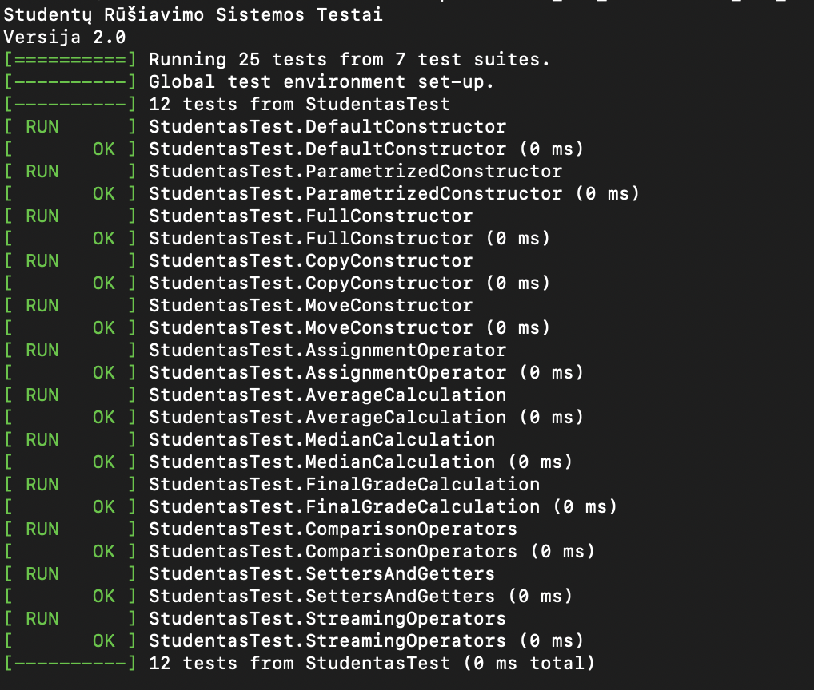

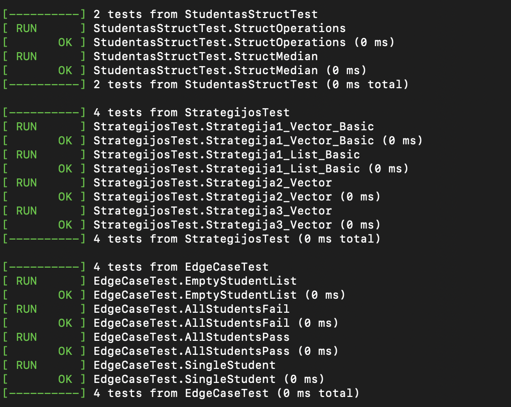

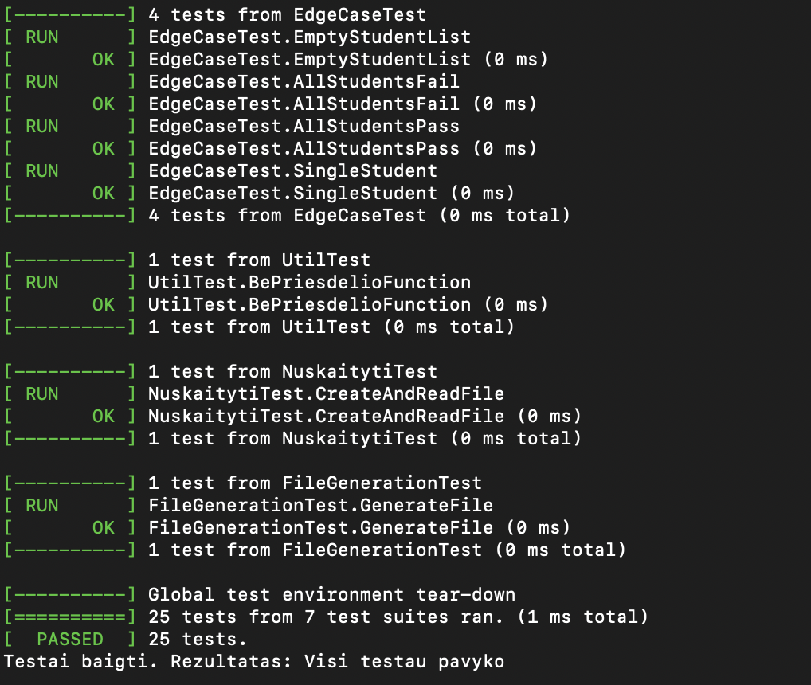

Kaip sugeneruoti: doxygen Doxyfile

Atidaryti dokumentaciją macOS: open docs/html/index.html

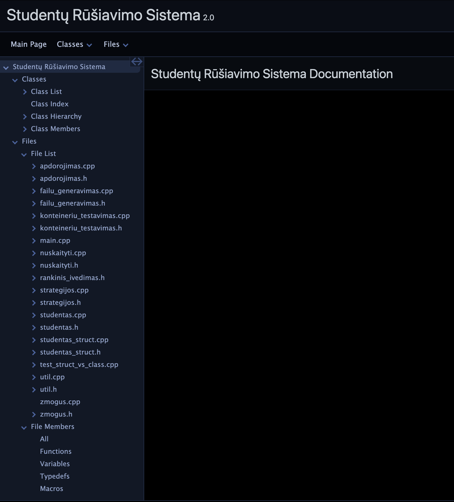

Autorius
Veronika Rimlevičiūtė - Vilniaus Universitetas, Duomenų mokslas.

